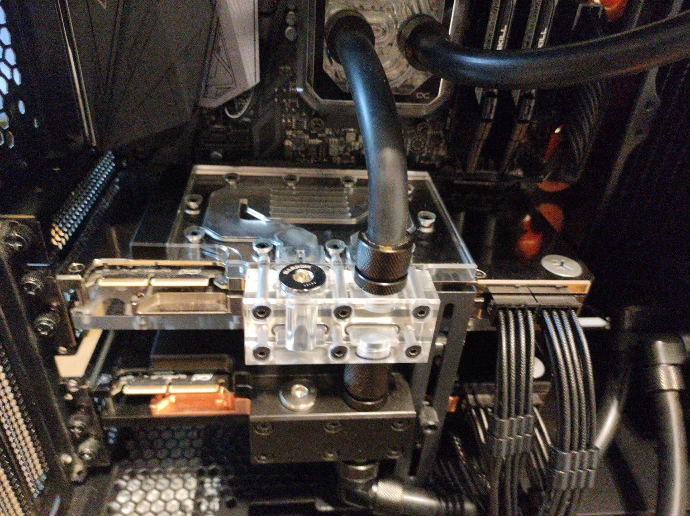
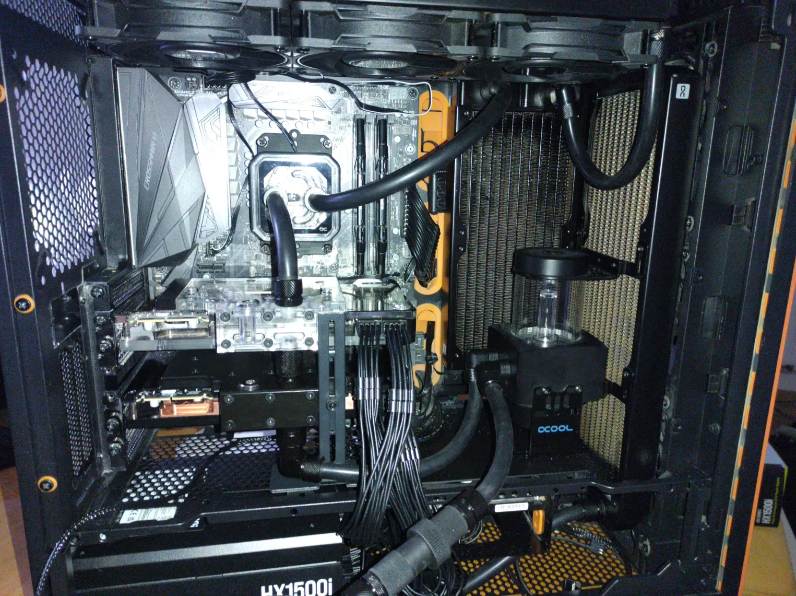

# How it began
At the end of last summer I pondered how I would fine-tune transformer models for Reinforcement Learning tasks and decided that I need a GPU capable of loading 20GB+ models. The best ratio of price to performance (and memory) seemed to be the NVIDIA RTX 3090 (24 GB). So I purchased a used one on Kleinanzeigen (similar to Ebay) for around 650 Euros, including an All-In-One water cooling loop. 

It worked. Sort of. When working on another private project of mine, a collaborative stock-valuation platform with AI assistance to maintain a knowledge graph, I quickly realized I could not use my 20 buck subscription of Anthropic (well technically you can work around but it is not legal) and needed to purchase dedicated tokens. In my Backend I employed the python package [Graphiti](https://github.com/getzep/graphiti) to experiment with automatically building knowledge graphs with 'episodic memory'. Querying web search and constructing a graph related to company news of a single company (a relatively small graph) consumed already 5 Euros in token spending. Clearly, the only feasible way for my hobbyist project is to run my own local AI models for inference.

# Hardware considerations on budget
Budget: max 2000-3000 Euros.

I compared dozens of GPUs: NVIDIA A2000 up to A6000, used H100s, Intel B70 Arc (considered them recently as they were announced), 4090s and even older datacenter cards such as the NVIDIA Tesla P40 (24GB). The P40 are not rarely as low as 200 Euros on Ebay. However, it is a quite old GPU, unlikely to support modern CUDA features/instructions - which is a no-starter for me. The mentioned NVIDIA cards are either too expensive or could not compete to the RTX 3090 in terms of value. 
The only competitor I could see was the Intel Arc B770. A new B770 is roughly 20-30% more expensive than a used RTX 3090 but the memory bandwidth (~456 GB/s) vs the 3090's 936 GB/s can't compete. Also, the compute power of the 3090 is superior: the RTX 3090 delivers 35.6 TFLOPS FP32 and benefits from the mature CUDA ecosystem, while Intel's oneAPI support in PyTorch and JAX is still catching up. 

# The Mainboard and influence of the PCIe speed
Every modern mainboard usually has at least one PCIe slot with 16 lanes connected to the CPU. The problems start if you want to plug in two GPUs. Now you need 32 lanes just for the GPUs but the consumer AMD and Intel CPUs only offer up to 28 (AMD Ryzen 7000/9000) and 24 (Intel 13.,14. Gen) for GPU usage, respectively. And trust me, I've checked this intensively. The best compromise you can get are mainboards which switch into a 8x/8x mode if two GPUs are present. Yes, this means the communication between CPU and each GPU is now only at 50% of the possible maximum limit. If you want both GPUs at 16x, you will need a workstation or server mainboard which do come at a higher price tag.

Does it matter? It depends.

It does matter for intense training. Not only do you need a communication channel for loading data onto the GPUs (by the CPU), but also GPU-to-GPU communication routed via the CPU. Gradient information etc. has to be shared in the general case. For inference (e.g. local LLMs) it matters much less. The model and prompts get loaded onto the GPU but most of the heavy work then happens between the GPU and VRAM. 

Which PCIe generation is necessary? 
For the RTX 3090 PCIe gen 4 is ideal and with this particular GPU you will not benefit from PCIe gen 5. In the inference case you likely won't even really feel the difference on PCIe gen 4 whether you go 8x/8x or have real 16x/16x available on your mainboard. Personally, my setup still has a 10 year old PCIe gen 3 mainboard (which offers 8x/8x, so each GPU has only 1/4 of its full bandwidth available as PCIe gen 3 has only half the speed of gen 4) and the setup works for me. How? NVLink. 



# RTX 3090 NVLink
The RTX 3090 is the last consumer GPU to support the NVLink connectors which lets both GPUs share and unify their memory at a bandwidth of 100 GB/s. This allows you to have 48GB of VRAM at your disposal. So I bought a second RTX 3090 of the same manufacturer and same model (just to be sure not to run into issues). If you are looking of an NVLink, be sure it is the right one for the 3090 and bridges the correct amount of standardized PCIe slot widths. I measured the required distance using a ruler on my Asus Hero 6 Crosshair (DDR3) Mainboard and determined to need a 3-slot NVLink. Don't bother even searching in European second hand markets for them, they have become really rare. Just search on Ebay for merchants from China and consider they cost roughly 250 Euros. 

Using the NVLink bypasses at least the previous 8x/8x PCIe gen 3 bottleneck in GPU-to-GPU communication on my old mainboard and is even faster than if I had a gen 4 board - which would be 32 GB/s! compared to the 100 GB/s of the NVLink.

| | x4 | x8 | x16 |
|---|---|---|---|
| PCIe Gen 3 | 4 GB/s | 8 GB/s | 16 GB/s |
| PCIe Gen 4 | 8 GB/s | 16 GB/s | 32 GB/s |
| PCIe Gen 5 | 16 GB/s | 32 GB/s | 64 GB/s |


My two RTX 3090s on the old PCIe Gen 3 board run in 8x/8x mode, giving each GPU **8 GB/s** to the CPU. On a PCIe Gen 4 board in 8x/8x mode that would double to **16 GB/s** — still well below the NVLink's **100 GB/s** for GPU-to-GPU traffic.


# Cooling options

Simple. Either go with the stock fans or with water cooling. My first RTX 3090 shipped with an AIO (pump integrated + 360mm radiator) cooling block already (which had corrosion issues just half a year later) and my second had a pretty quality EW water block. I pondered whether to run them separately or build one custom loop and went with the latter option, thereby also replacing the Alphacool EisWolf-2 water block of the first GPU altogether (I will write a separate blog post about this topic). 

I got a starter-set from Alphacool, including a pump, coolant liquid, a radiator, transparent soft-tubes and some fittings for around 180 Euros. After adding more fittings to get all components connected (3 radiators, CPU, 2x GPU, water pump, temperature measure device) it was far more expensive than I hoped it would be. 

Another issue: how many radiators are required to get a half-way quiet system and dissipate up to 700W peak? (neglecting the CPU which is a moderate Ryzen 5 2600 in my case)? The answer is: the more, the better. But only a few PC cases can host more than 2-3 360mm radiators. If you really want to push the limits, go for the [Phantek Enthoo Pro 2 Server](https://phanteks.com/product/enthoo-pro-2-server-edition-tg/) case. The materials are having a little bit a cheap feeling but it does have plenty of space for water cooling solutions at roughly 180 Euros. AND it is designed for more-than-usual PCIe slots, which comes in handy if you want to have 3, 4, 5 or 6 GPUs (depending on their slot-widths).  

I really wanted to recycle my [BeQuiet SilentBase 601](https://www.bequiet.com/en/case/1506) case but it only allows for 2x 360mm radiators and I had a third one (240mm) already around. This was then solved via an angle grinder and sacrificing the hard-drive bay-slots and cutting a rectangle into the right cover of the case, some drilling to mount 12" fans and dust-protection on top. 



The temperatures measured under a distributed workload on random data roughly average to the mid-high 60 degree Celsius range after half an hour. GPU number 1, which I have put into a water block myself with a lot of care mostly stayed 4 degrees lower than the other one. So, taking care when applying the thermal pastes and/or pads does matter. But also probably the age of this stuff. I do not possess any device to seriously measure the noise level. Under full load - of course it is not pleasant. But it is less bad than with regular stock coolers. If you really want to take it to an extreme, you can also buy external radiators and scale it [really big](https://www.tomshardware.com/pc-components/liquid-cooling/new-massive-liquid-cooling-radiator-weighs-over-35lbs-holds-nine-200mm-fans). I did not like this solution visually, nor cost-wise and stayed with an internal solution. If I had more RTX 3090 cards, then internal solutions are no more option and you have to go with external radiators. 

```python
import os
import torch
import torch.nn as nn
import torch.optim as optim
import torch.distributed as dist
from torch.nn.parallel import DistributedDataParallel as DDP

# -----------------------
# Setup DDP
# -----------------------
def setup():
    dist.init_process_group(backend="nccl")
    local_rank = int(os.environ["LOCAL_RANK"])
    torch.cuda.set_device(local_rank)
    return local_rank

def cleanup():
    dist.destroy_process_group()

# -----------------------
# Big Model (ResNet50 scaled up)
# -----------------------
class BigModel(nn.Module):
    def __init__(self):
        super().__init__()
        self.net = nn.Sequential(
            nn.Conv2d(3, 128, 3, padding=1),
            nn.ReLU(),
            nn.Conv2d(128, 256, 3, padding=1),
            nn.ReLU(),
            nn.Conv2d(256, 512, 3, padding=1),
            nn.ReLU(),
            nn.Conv2d(512, 512, 3, padding=1),
            nn.ReLU(),
            nn.AdaptiveAvgPool2d((1, 1)),
            nn.Flatten(),
            nn.Linear(512, 1000)
        )

    def forward(self, x):
        return self.net(x)

# -----------------------
# Synthetic Data Generator
# -----------------------
def get_batch(batch_size, device):
    # Large images → heavy compute
    x = torch.randn(batch_size, 3, 224, 224, device=device)
    y = torch.randint(0, 1000, (batch_size,), device=device)
    return x, y

# -----------------------
# Training
# -----------------------
def train():
    local_rank = setup()
    device = torch.device(f"cuda:{local_rank}")

    model = BigModel().to(device)
    model = DDP(model, device_ids=[local_rank])

    optimizer = optim.AdamW(model.parameters(), lr=1e-3)
    criterion = nn.CrossEntropyLoss()

    scaler = torch.cuda.amp.GradScaler()

    # BIG batch size → push GPU
    batch_size = 32

    for epoch in range(10):
        for step in range(200):  # increase for more load
            inputs, targets = get_batch(batch_size, device)

            optimizer.zero_grad()

            with torch.cuda.amp.autocast():
                outputs = model(inputs)
                loss = criterion(outputs, targets)

            scaler.scale(loss).backward()
            scaler.step(optimizer)
            scaler.update()

            if step % 20 == 0 and local_rank == 0:
                print(f"Epoch {epoch} Step {step} Loss {loss.item():.4f}")

    cleanup()

if __name__ == "__main__":
    train()
```


# Benchmarks

Coming soon.